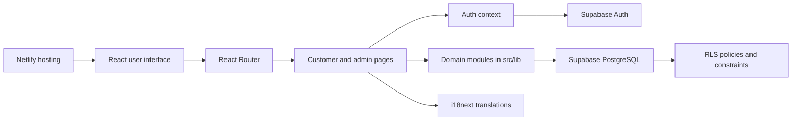
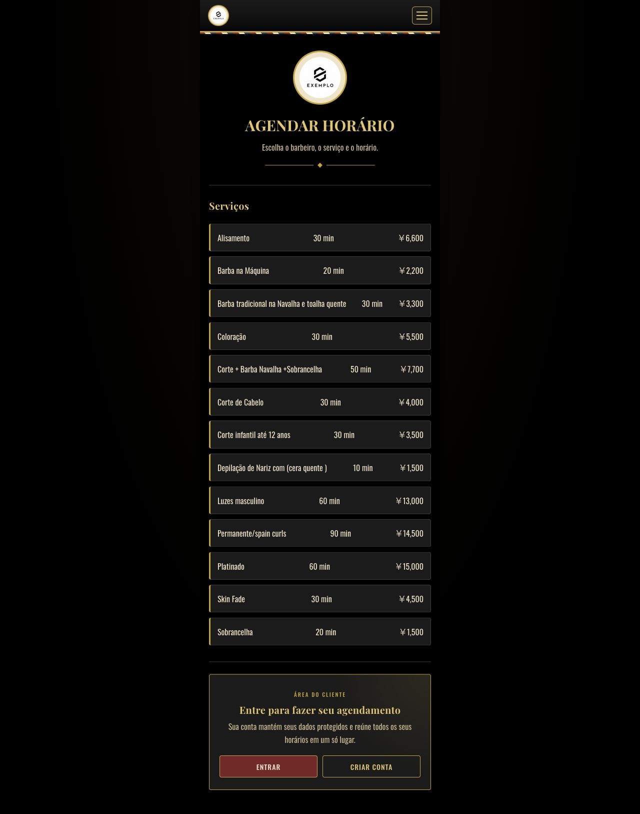
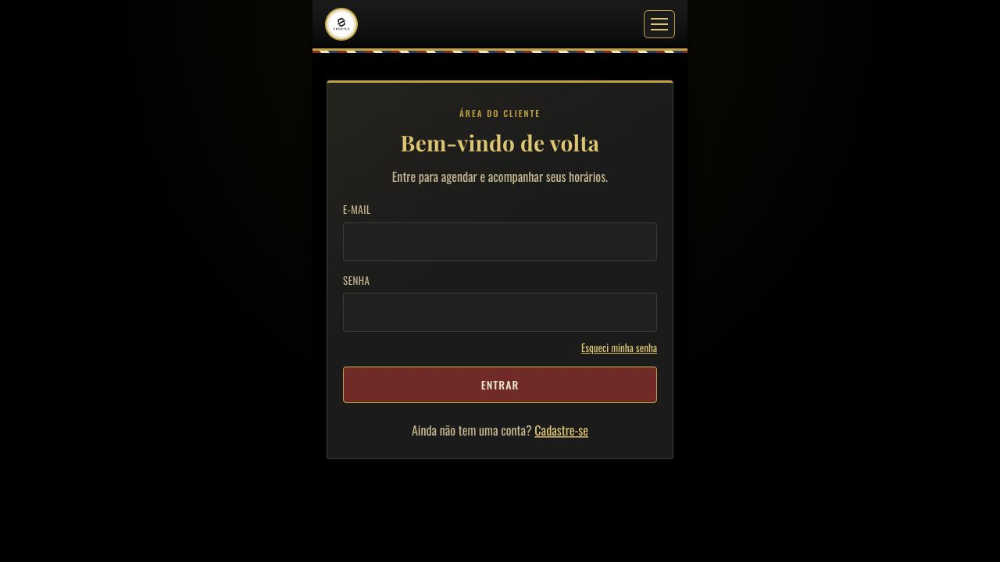

# Agendamento App

<div align="center">

**A bilingual appointment and operations platform for service businesses in Japan.**

[](https://react.dev/)
[](https://vite.dev/)
[](https://supabase.com/)
[](https://www.netlify.com/)

[View Live Demo](https://agendamento-app-giguibi.netlify.app/)

</div>

## Overview

Agendamento App solves a common problem for barbershops and other appointment-based businesses: bookings, staff availability, and customer information are often managed across messages, paper calendars, and separate tools.

The application brings the complete scheduling workflow into one place. Customers can explore services, choose a professional, find an available time, and manage their appointments. Administrators can organize the daily agenda, control availability, manage services, and register walk-in bookings.

The interface supports Portuguese and Japanese, making the project especially relevant to multicultural service businesses in Japan.

## Features

### Customer experience

- Browse services with prices and estimated duration
- Choose a preferred professional or accept any available professional
- Select a date and view only available time slots
- Confirm an appointment through a guided booking flow
- Generate a pre-filled WhatsApp message after booking
- View upcoming and previous appointments
- Cancel confirmed appointments from the customer account

### Authentication and account

- Email and password registration
- Secure login and persistent sessions with Supabase Auth
- Password recovery and reset flow
- Customer profile and appointment history
- Role-based access for customers and administrators

### Admin dashboard

- Daily agenda filtered by date and professional
- Manual booking registration for walk-in customers
- Appointment cancellation and status management
- Workday and time-slot generation for each professional
- Protection against removing availability that already has bookings
- Service management with name, description, duration, and price
- Portuguese and Japanese content management

### Reliability and localization

- Portuguese and Japanese interface with automatic language detection
- Database-level protection against double booking
- Row Level Security policies for controlled data access
- Responsive layout for mobile and desktop
- SPA routing configured for production deployment

## Tech Stack

| Area | Technology | Purpose |
| --- | --- | --- |
| Front end | React | Component-based user interface |
| Build tool | Vite | Local development and optimized production builds |
| Routing | React Router | Public, authenticated, and admin routes |
| Backend | Supabase | Authentication, PostgreSQL database, and API |
| Localization | i18next + react-i18next | Portuguese and Japanese translations |
| Styling | CSS | Responsive layouts and application design |
| Hosting | Netlify | Continuous deployment and SPA hosting |
| Code quality | Oxlint | Static analysis and linting |

## Architecture

The project uses a layered front-end architecture. Pages and reusable components handle presentation, the authentication context manages session state, and domain modules inside `src/lib` isolate communication with Supabase.



### Main layers

- **Presentation:** pages and reusable UI components in `src/pages` and `src/components`
- **Application state:** authentication, profile, and role state through `AuthContext`
- **Domain logic:** booking, agenda, availability, services, and profile modules in `src/lib`
- **Data and security:** Supabase Auth, PostgreSQL, Row Level Security, and SQL migrations
- **Deployment:** Vite production build hosted on Netlify with an SPA redirect rule

## Live Demo

The current version is available at:

### [Open Agendamento App](https://agendamento-app-giguibi.netlify.app/)

> The deployed application is a portfolio and learning project. Demo data and branding may change as development continues.

## Screenshots

### Booking page



### Login page



## Technical Decisions and What I Learned

### Preventing double bookings

Availability checks in the interface improve the user experience, but they are not enough to guarantee data integrity. The database therefore uses a partial unique index for confirmed appointments, ensuring that two customers cannot reserve the same time slot even if requests arrive almost simultaneously.

### Authorization close to the data

Authentication is handled by Supabase Auth, while Row Level Security policies control which records each user can access. Admin routes also validate the user role before displaying operational tools.

### Separating interface and domain logic

Booking, agenda, services, availability, and profile operations are organized into dedicated modules. This keeps page components easier to read and makes the data-access logic simpler to maintain.

### Handling asynchronous interfaces safely

Some filtered views use request sequencing so that a slower, older response cannot overwrite the result of the user's latest selection. This is especially useful in the agenda and booking flows.

### Designing for a multilingual audience

The application uses i18next for interface translations and stores service content in both Portuguese and Japanese. Building this feature reinforced the importance of avoiding hard-coded text and planning content structures for localization from the beginning.

### Deploying a single-page application

Netlify is configured to serve the Vite build from `dist` and redirect application routes to `index.html`, allowing React Router pages to load correctly when accessed directly.

## Project Structure

```text
agendamento-app/
├── assets/
│   └── screenshots/
├── src/
│   ├── components/       # Reusable interface components
│   ├── contexts/         # Authentication and session state
│   ├── hooks/            # Shared React hooks
│   ├── i18n/             # Localization configuration and resources
│   ├── lib/              # Supabase client and domain modules
│   ├── pages/            # Customer, authentication, and admin pages
│   └── styles/           # Application styles
├── supabase/             # Database configuration and SQL migrations
├── netlify.toml          # Build and SPA redirect configuration
└── package.json
```

## Running Locally

### Prerequisites

- Node.js 20 or newer
- npm
- A Supabase project

### Installation

1. Clone the repository:

   ```bash
   git clone https://github.com/paulohashisaka/agendamento-app.git
   cd agendamento-app
   ```

2. Install the dependencies:

   ```bash
   npm install
   ```

3. Create a `.env` file in the project root:

   ```env
   VITE_SUPABASE_URL=your_supabase_project_url
   VITE_SUPABASE_ANON_KEY=your_supabase_anon_key
   ```

4. Start the development server:

   ```bash
   npm run dev
   ```

5. Open the local address shown by Vite in your browser.

## Available Scripts

| Command | Description |
| --- | --- |
| `npm run dev` | Starts the local development server |
| `npm run build` | Creates an optimized production build |
| `npm run preview` | Previews the production build locally |
| `npm run lint` | Checks the source code with Oxlint |

## Author

**Paulo Hashisaka**

- [GitHub](https://github.com/paulohashisaka)
- Based in Japan
- Web development learner focused on practical, multilingual products
